# Weather Vibes

Une petite application météo : tu tapes une ville, elle affiche le temps qu'il fait accompagné d'une **vibe**, c'est-à-dire un thème visuel et un message adaptés à la météo.

L'application est volontairement simple. Le vrai sujet du projet, c'est tout ce qu'il y a autour : **une chaîne de déploiement complète sur Kubernetes**, de la conteneurisation jusqu'au déploiement GitOps, avec une gestion propre des secrets.

> **Démo en ligne** : [weather-vibes-alpha.vercel.app](https://weather-vibes-alpha.vercel.app/)
> Cette démo est hébergée séparément sur Vercel. La version Kubernetes décrite ici tourne sur un cluster local.

---

## Sommaire

- [Aperçu technique](#aperçu-technique)
- [Comment fonctionne l'application](#comment-fonctionne-lapplication)
- [Lancer le projet en local](#lancer-le-projet-en-local)
- [La chaîne CI/CD](#la-chaîne-cicd)
- [Gestion des secrets](#gestion-des-secrets)
- [Structure du projet](#structure-du-projet)
- [Aide-mémoire](#aide-mémoire)
- [Limites connues et pistes d'amélioration](#limites-connues-et-pistes-damélioration)

---

## Aperçu technique

| Élément       | Choix                                                 |
| ------------- | ----------------------------------------------------- |
| Backend       | Python, FastAPI, httpx                                |
| Frontend      | HTML (Jinja2), CSS et JavaScript, sans framework      |
| Données météo | API OpenWeatherMap (clé gratuite requise)             |
| Conteneur     | Docker, image de base `python:3.12-slim`              |
| Registre      | Docker Hub : `adriendockeraccount/weather-vibes`      |
| CI            | Tekton : clone, build avec Kaniko, mise à jour du manifest |
| CD            | Argo CD, qui synchronise le dossier `k8s/`            |
| Secrets       | Sealed Secrets (Bitnami)                              |
| Cluster       | k3s à trois nœuds, sur OrbStack                       |

---

## Comment fonctionne l'application

1. Le navigateur charge la page `/`, puis envoie la ville saisie à `GET /weather?city=...`.
2. Le backend interroge OpenWeatherMap, en unités métriques et en français.
3. `VibeMapper` traduit la condition météo (`Clear`, `Rain`, `Snow`...) en une vibe : un thème (`sunny`, `rainy`, `night`...) et un message.
4. Le frontend applique le thème (fond, illustration SVG) et affiche le résultat. La dernière ville consultée est mémorisée dans le navigateur.

**Routes disponibles**

| Route                     | Rôle                                            |
| ------------------------- | ----------------------------------------------- |
| `GET /`                   | La page web                                     |
| `GET /weather?city=Paris` | La météo au format JSON                         |
| `GET /health`             | Point de contrôle, prévu pour les probes Kubernetes |
| `GET /docs`               | Documentation interactive générée par FastAPI   |

---

## Lancer le projet en local

**Prérequis** : Python 3.9 ou plus récent, et une clé API OpenWeatherMap, à créer sur [home.openweathermap.org/api_keys](https://home.openweathermap.org/api_keys).

```bash
python3 -m venv venv
source venv/bin/activate
pip install -r requirements.txt

cp .env.example .env        # renseigner ensuite OPENWEATHER_API_KEY dans .env

uvicorn app.main:app --reload
```

L'application est disponible sur [http://localhost:8000](http://localhost:8000).

**Avec Docker**

```bash
docker build -t weather-vibes .
docker run -p 8000:8000 --env-file .env weather-vibes
```

---

## La chaîne CI/CD

Le pipeline construit l'image, la publie, puis met à jour le manifest dans Git. Argo CD voit ce changement et déploie la nouvelle version. Le CI ne touche jamais directement au cluster : **Git est le seul point de passage** entre les deux.

```mermaid
%%{init: {"theme": "base", "themeVariables": {"fontFamily": "Inter, Segoe UI, Helvetica, Arial, sans-serif", "fontSize": "14px", "lineColor": "#94a3b8", "clusterBkg": "#f8fafc", "clusterBorder": "#cbd5e1", "edgeLabelBackground": "#ffffff"}}}%%
flowchart LR
    dev(["Développeur<br/>pousse le code,<br/>lance le pipeline"])

    subgraph CI["CI  ·  Tekton"]
        direction TB
        clone["1 · clone<br/>récupère le dépôt"]
        build["2 · build-push<br/>Kaniko construit l'image<br/>tag = SHA du commit"]
        update["3 · update-manifest<br/>écrit le nouveau tag<br/>dans k8s/deployment.yaml"]
        clone --> build --> update
    end

    hub[("Docker Hub<br/>weather-vibes")]
    repo[("GitHub<br/>dossier k8s/")]

    subgraph CD["CD  ·  Argo CD"]
        argo["Argo CD<br/>compare Git<br/>et le cluster"]
    end

    app(["weather-vibes<br/>2 réplicas<br/>NodePort 30090"])

    dev --> clone
    build -- "push de l'image" --> hub
    update -- "commit [skip ci]" --> repo
    repo -- "surveillé" --> argo
    argo -- "synchronise" --> app
    hub -. "image téléchargée" .-> app

    classDef actor  fill:#ede9fe,stroke:#7c3aed,color:#3b0764,stroke-width:1.5px
    classDef ci     fill:#dbeafe,stroke:#2563eb,color:#1e3a8a,stroke-width:1.5px
    classDef store  fill:#fef3c7,stroke:#d97706,color:#78350f,stroke-width:1.5px
    classDef cd     fill:#ffe4e6,stroke:#e11d48,color:#881337,stroke-width:1.5px
    classDef runapp fill:#dcfce7,stroke:#16a34a,color:#14532d,stroke-width:1.5px

    class dev actor
    class clone,build,update ci
    class hub,repo store
    class argo cd
    class app runapp

    style CI fill:#eff6ff,stroke:#93c5fd,color:#1e3a8a
    style CD fill:#fff1f2,stroke:#fda4af,color:#881337
```



| Couleur | Rôle |
| ------- | ---- |
| Violet  | Action humaine |
| Bleu    | Intégration continue (Tekton) |
| Jaune   | Stockage : registre d'images et dépôt Git |
| Rose    | Déploiement continu (Argo CD) |
| Vert    | Application en production |

| Étape                | Ce qui se passe                                                                  |
| -------------------- | -------------------------------------------------------------------------------- |
| **1. clone**         | Le dépôt GitHub est cloné dans un volume partagé entre les tâches                |
| **2. build-push**    | Kaniko construit l'image et la pousse sur Docker Hub, taguée avec le hash du commit |
| **3. update-manifest** | Le tag d'image est remplacé dans `k8s/deployment.yaml`, puis un commit `[skip ci]` est poussé |
| **Argo CD**          | Il détecte le changement dans `k8s/` et applique les manifests sur le cluster    |

Comme le tag est toujours le hash du commit source, on sait à tout moment **exactement quel code tourne dans le cluster**.

**Lancer un build**

```bash
kubectl apply -f tekton/          # une seule fois : tâches, pipeline, compte de service
kubectl create -f tekton/pipeline-run.yaml
tkn pipelinerun logs --last -f
```

> Les tâches `git-clone` et `kaniko` viennent du catalogue Tekton et doivent être installées dans le cluster : elles ne sont pas dans ce dépôt. L'application Argo CD est, elle aussi, configurée directement dans le cluster.

---

## Gestion des secrets

Aucun secret n'est stocké en clair dans le dépôt.

| Secret                | À quoi il sert                             | Où il se trouve                                                            |
| --------------------- | ------------------------------------------ | -------------------------------------------------------------------------- |
| `OPENWEATHER_API_KEY` | Appeler OpenWeatherMap                     | En local : `.env`, ignoré par Git. Dans le cluster : `k8s/sealed-secret.yaml` |
| `dockerhub-secret`    | Permettre à Kaniko de pousser l'image      | Créé à la main dans le cluster, jamais commité                             |
| `github-token`        | Pousser le commit de mise à jour du manifest | Créé à la main dans le cluster, jamais commité                           |

Le SealedSecret est chiffré avec la clé publique du contrôleur Sealed Secrets. Il peut donc être commité sans risque : **seul ce cluster peut le déchiffrer**.

<details>
<summary><strong>Changer la clé OpenWeatherMap</strong></summary>

```bash
kubectl create secret generic weather-secret \
  --from-literal=openweather-api-key=NOUVELLE_CLE \
  --dry-run=client -o yaml \
  | kubeseal --format yaml > k8s/sealed-secret.yaml
```

Il suffit ensuite de commiter le fichier. Argo CD applique le nouveau secret, et les pods le prennent en compte à leur prochain redémarrage.

</details>

---

## Structure du projet

```
app/
  main.py          point d'entrée : assemble configuration, services et routes
  config.py        paramètres lus depuis les variables d'environnement
  api/             routes HTTP (pages, weather, health) et gestion des erreurs
  services/        client OpenWeatherMap, logique métier, association météo -> vibe
  models/          modèles de données (WeatherReport, Vibe)
  exceptions/      erreurs métier, chacune associée à un code HTTP
  templates/       page HTML
  static/          CSS, JavaScript et illustrations SVG par type de météo
k8s/               manifests Kubernetes surveillés par Argo CD
tekton/            pipeline CI et ses tâches
Dockerfile
requirements.txt
.env.example       modèle du fichier .env
```

---

## Aide-mémoire

- **Ajouter ou modifier une vibe** : tout se passe dans `app/services/vibe_mapper.py`.
- **Erreur de clé API** : vérifier `.env` en local, ou le secret `weather-secret` dans le cluster.
- **Nouveau cluster** : le SealedSecret n'est valable que pour le cluster qui l'a chiffré. Il faut le régénérer avec `kubeseal`.
- **Commits `ci: deploy ...`** : ils sont créés automatiquement par le pipeline. Penser à faire `git pull` avant de travailler.

---

## Limites connues et pistes d'amélioration

C'est un projet d'apprentissage qui tourne sur un cluster local, sans accès public. La chaîne GitOps fonctionne de bout en bout, mais certains éléments restent manuels ou simplifiés.

**Les trois chantiers prioritaires pour aller vers la production :**

1. Un cluster accessible, avec Ingress et HTTPS
2. Des tests et un scan d'image dans le pipeline
3. Des secrets entièrement gérés depuis Git

<details>
<summary><strong>Voir le détail des limites</strong></summary>

<br>

**Environnement**

| Limite actuelle | Piste d'amélioration |
| --- | --- |
| Cluster local sans IP publique : l'app est exposée en NodePort et consultée via un tunnel SSH | Cluster cloud, Ingress (Traefik), nom de domaine, HTTPS avec cert-manager |
| Tout est déployé dans le namespace `default` | Namespaces séparés pour `dev`, `staging` et `production` |

**Pipeline CI (Tekton)**

| Limite actuelle | Piste d'amélioration |
| --- | --- |
| Déclenchement manuel : GitHub ne peut pas joindre le cluster local, donc pas de webhook | Tekton Triggers avec un point d'entrée public |
| Aucune étape de qualité : ni tests, ni lint, ni scan de vulnérabilités | Tâches `pytest` et `ruff`, scan d'image avec Trivy avant le push |
| Le pipeline pousse directement sur `main`, sans relecture | Ouvrir une pull request pour promouvoir une version |
| Code et manifests dans le même dépôt : un commit par déploiement, `[skip ci]` nécessaire pour éviter une boucle | Séparer le dépôt applicatif et le dépôt de configuration |
| Les anciens PipelineRuns s'accumulent | Nettoyage automatique des exécutions terminées |

**Déploiement (Argo CD)**

| Limite actuelle | Piste d'amélioration |
| --- | --- |
| Détection par interrogation de Git, environ toutes les 3 minutes | Webhook GitHub vers Argo CD |

**Secrets**

| Limite actuelle | Piste d'amélioration |
| --- | --- |
| `dockerhub-secret` et `github-token` sont créés à la main : le projet n'est pas entièrement reproductible depuis Git | Sealed Secrets, ou External Secrets avec un coffre comme Vault |
| La clé Sealed Secrets est liée au cluster : un cluster recréé ne peut plus déchiffrer le secret | Sauvegarder la clé du contrôleur Sealed Secrets |

**Application**

| Limite actuelle | Piste d'amélioration |
| --- | --- |
| Pas de probes ni de limites de ressources dans le Deployment | `readinessProbe` et `livenessProbe` sur `/health`, `requests` et `limits` CPU et mémoire |
| Dépendance à OpenWeatherMap : panne ou quota gratuit atteint | Mise en cache des réponses pendant quelques minutes |
| Certaines images utilisent le tag `latest`, par exemple `alpine/git` | Épingler les versions, voire les digests |

</details>